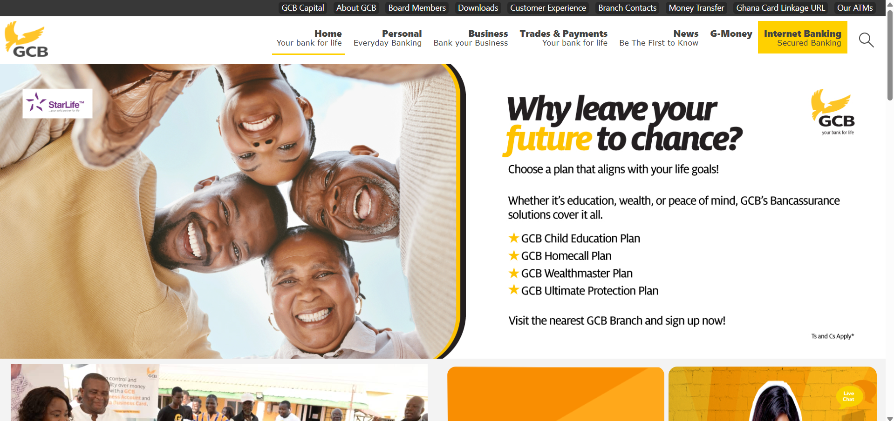
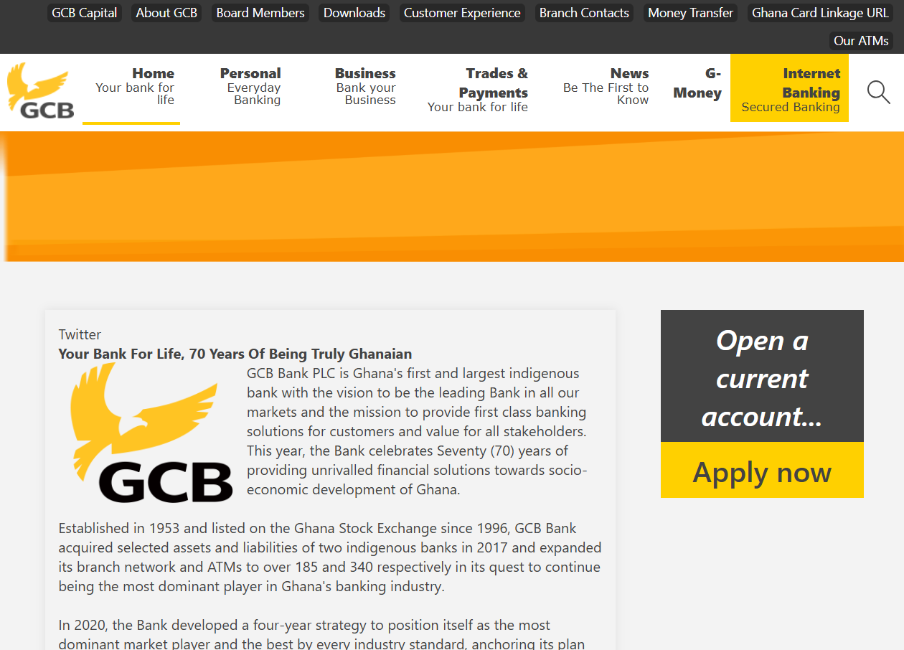
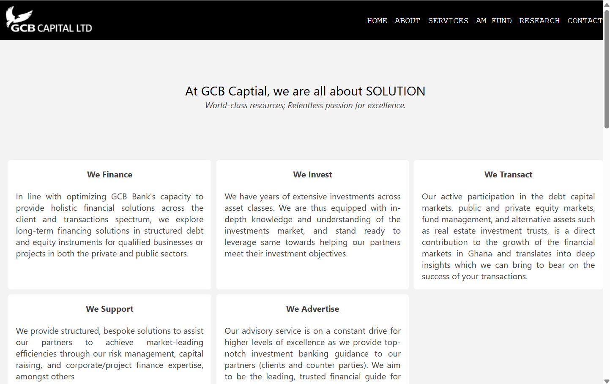

# GCB Clone

A frontend recreation of the **GCB Bank Ghana** official website using **HTML**, **CSS**, and a little **JavaScript** — built entirely from scratch.

---

## 📂 Project Structure

- **index.html** – Main landing page
- **about.html** – About page
- **board-members.html** – Board members page
- **branch-contacts.html** – Branch contacts page
- **customer-exp.html** – Customer experience page
- **downloads.html** – Downloads page
- **gcb-atms.html** – ATM locations page
- **gcbcapital.html** – GCB Capital page
- **linkcard.html** – LinkCard page
- **money-transfer.html** – Money transfer page
- **freestyles.css** – Stylesheet
- **siteimages/** – Assets (logos, icons, images, etc.)

---

## 🚀 Features

- Fully responsive **static front-end clone**
- Clean, semantic HTML structure
- Custom CSS styling (no frameworks)
- Lightweight JavaScript for interactions
- Organized assets for easy customization

---

## 🔧 Installation & Usage

1. Clone the repository:

   ```bash
   git clone https://github.com/kwasihenri/gcbclone.git
   ```

2. Navigate into the project folder:

   ```bash
   cd gcbclone
   ```

3. Open `index.html` in your preferred browser.

---

## 📸 Screenshots

### Homepage  


### About Page  


### GCBcapital Page  



---

## 📌 Notes

- This project is **for educational purposes only**.  
- All rights to original branding, logos, and assets belong to **GCB Bank Ghana**.  
- This is a **frontend clone** and not affiliated with the official bank.

---

## 📝 License

This project is open-source under the [MIT License](LICENSE).

---

## 👤 Author

- GitHub: [kwasihenri](https://github.com/kwasihenri)

